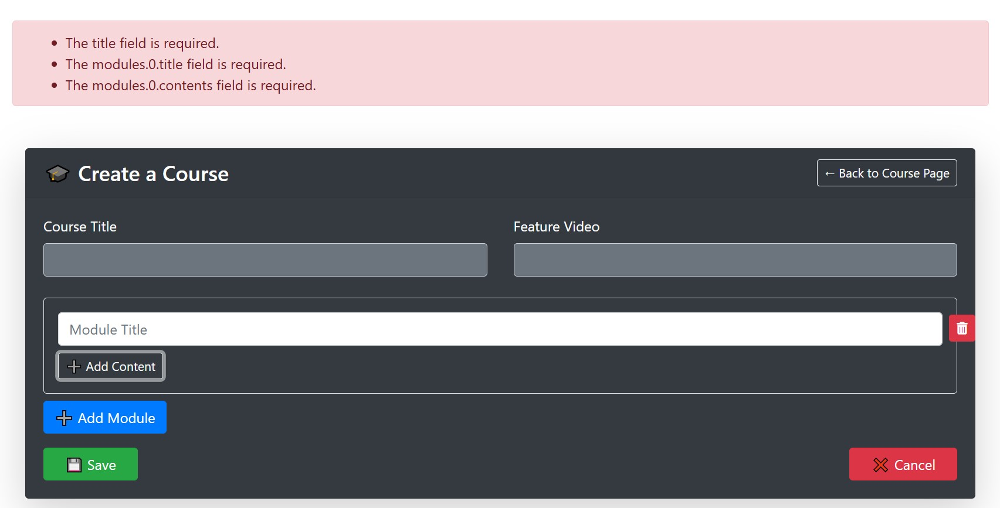
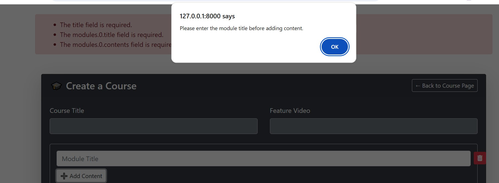
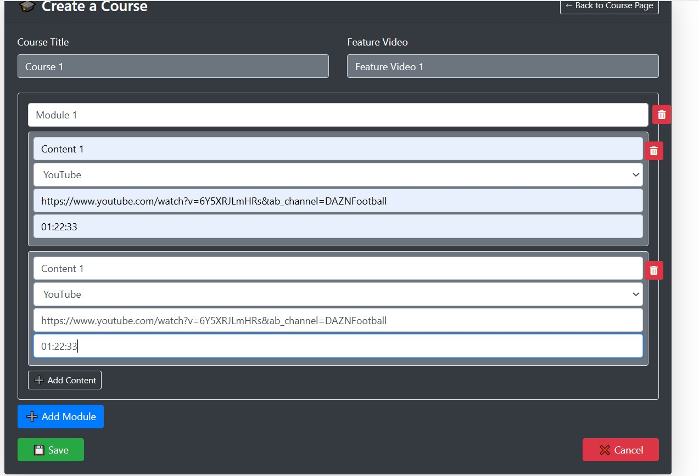
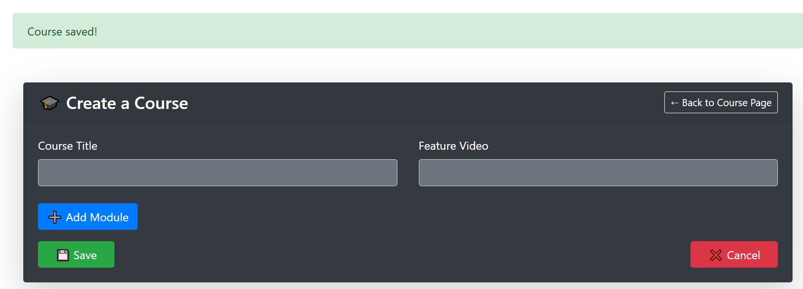

# Laravel Course Creation Project

A simple Laravel app to create courses with dynamic modules and nested contents.

## Features
- Course fields: title, description, category
- Unlimited modules per course
- Unlimited content items per module
- Frontend dynamic form with jQuery
- Frontend & backend validation
- Database storage using migrations and proper relationships

